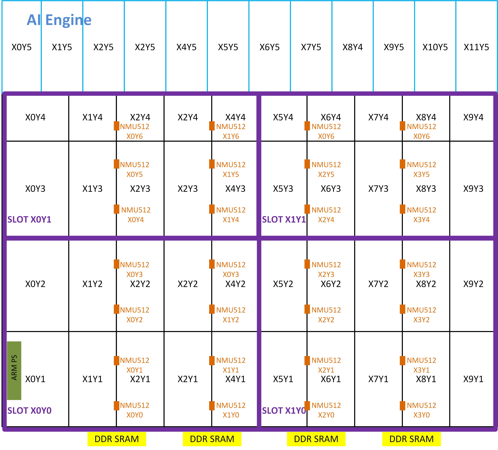

<!--
Copyright (c) 2024 RapidStream Design Automation, Inc. and contributors.  All rights reserved.
The contributor(s) of this file has/have agreed to the RapidStream Contributor License Agreement.
-->


# TAPA Flow: Bandwidth23

## Introduction

The AMD Versal device introduces a revolutionary hardware architecture for FPGA developers.
One standout feature is the distributed NoC AXI master/slave ports spread across the entire chip,
which is especially beneficial for kernels requiring numerous ports. For instance, in Alveo devices,
utilizing HBM bandwidth at the chip's base requires routing 32 AXI ports, each 512 bits wide, close
to the HBM—posing significant implementation challenges. With the Versal architecture, however,
these 32 AXI ports can be distributed across different regions of the chip, alleviating local routing congestion.

Nevertheless, routing these ports across the chip introduces the challenge of connecting them
with long wires. To optimize the effectiveness of the NoC architecture, RapidStream can be employed
to automatically insert pipeline registers between distributed logic. This approach not only achieves
high bandwidth through multiple AXI ports but also mitigates the local routing congestion seen in
previous architectures like the Alveo device.


In this recipe, we demonstrate how to leverage RapidStream to optimize a TAPA project that
includes a kernel with 23 AXI ports, each 512 bits wide. The process involves the following key steps:

- Compile the TAPA C++ code into a Vitis-compatible `.xo` file using TAPA.
- Optimize the generated `.xo` file with RapidStream to produce an enhanced `.xo` file.
- Use Vitis to compile the optimized `.xo` file into an .xclbin file for FPGA deployment.

## Tutorial

### Step 1 : Generate the Xilinx Object File (`.xo`)


We utilize [Rapidstream-TAPA](https://github.com/rapidstream-org/rapidstream-tapa) to generate the `.xo` file.
The original C++ source files are located in design/src. To compile C++ to `.xo` using TAPA, we use the commands shown below.
For your convenience, you can also execute `make xo` command in the terminal supported by our [Makefile](Makefile).

We use [Rapidstream-TAPA](https://github.com/rapidstream-org/rapidstream-tapa)  to generate the `.xo` file,
with the original C++ source files located in the [design](./design) directory. To compile the C++ code
into a `.xo` file using TAPA, follow the commands provided below. For convenience,
you can also execute the `make xo` command in the terminal, as supported by our Makefile.

```bash
mkdir -p build/run_vck5000.py
cd build/run_vck5000.py && tapa compile \
--top bandwidth23 \
--part-num xcvc1902-vsvd1760-2MP-e-S \
--clock-period 3.33 \
-o bandwidth23.xo \
-f design/bandwidth23.cpp \
2>&1 | tee tapa.log
```

### Step 2: Define Virtual Device

The VCK5000 device is equipped with 4x7 NMU512 and NSU512 ports across the chip (only NMU512 ports are shown). For our design, we focus solely on the FPGA fabric and not the AI Engine. We define four slots for the virtual device, each containing either six or eight NMU512 ports to connect internal logic to the DDR SRAM at the base. A Python-based script, [run_vck5000.py](./run_vck5000.py), is provided as a reference for defining the virtual device using the RapidStream API.




You can run the `run_vck5000.py` script by invoking RapidStream as shown below, or simply type `make device` in the terminal. This will generate a `device.json` file, which outlines all the device features, including slot resources, slot locations, and more.


```bash
rapidstream run_vck5000.py
```


### Step 2: Use Rapidstream to Optimize `.xo` Design


The RapidStream flow conducts design space exploration and generates solutions  by taking all TAPA-generated `.xo` file as the input.
The RapidStream flow for TAPA requires the following key inputs:

- **Platform**: The Vitis platform (e.g., `xilinx_u280_gen3x16_xdma_1_202211_1`).
- **Device**: virtual device define by calling rapidstream APIs based on platform (e.g., `get_u280_vitis_device_factory`).
- **.xo file**: The `.xo` file generated by TAPA
- **Connectivity** (.ini): Include the configuration file for `v++` design/config/run.py/link_config.ini.
- **top_module_name**: Top module name for the kernel.
- **Clock**: All the clock and frequencies.
- **Flatten Module**: Within a design, not all modules need to be optimized. The flatten module name is the target module rapidstream will optimize.

The Python snippet below shows how we initiate rapidstream instance to set up the rapidstream environment.

```Python
from rapidstream import get_u280_vitis_device_factory, RapidStreamTAPA
import os

CURR_DIR = os.path.dirname(os.path.abspath(__file__))
INI_PATH = f"{CURR_DIR}/design/config/link_config.ini"
VITIS_PLATFORM = "xilinx_u280_gen3x16_xdma_1_202211_1"
XO_PATH = f"{CURR_DIR}/design/generated/data_decoding.xo"
kernel_name = "data_decoding"
factory = get_u280_vitis_device_factory(VITIS_PLATFORM)
rs = RapidStreamTAPA(f"{CURR_DIR}/build")
rs.set_virtual_device(factory.generate_virtual_device())
rs.add_xo_file(XO_PATH)
rs.set_vitis_platform(VITIS_PLATFORM)
rs.set_vitis_connectivity_config(INI_PATH)
rs.set_top_module_name(kernel_name)
rs.add_clock("ap_clk", 3.33)
rs.add_flatten_targets([kernel_name])
```

The HBM AXI port connection is described in design/config/run.py/link_config.ini.

```bash
[connectivity]
sp=data_decoding.input_port:HBM[0:1]
sp=data_decoding.output_port0_32b_8b:HBM[16:17]
sp=data_decoding.output_port1_16b_8b:HBM[18:19]
sp=data_decoding.output_port2_16b_8b:HBM[20:21]
sp=data_decoding.output_port3_8b:HBM[22:23]
sp=data_decoding.output_port4_Track:HBM[24:25]
```

As a result, it is necessary to assign the kernel ports to the appropriate slots. The Python code below demonstrates this process. For comprehensive linking details, please refer to the design/config/run.py/link_config.ini file.

 ```Python
# Bind ports to HBM 16-31
right_slot = "SLOT_X1Y0:SLOT_X1Y0"
left_slot = "SLOT_X0Y0:SLOT_X0Y0"
rs.assign_port_to_region(".*input_port.*", left_slot)
rs.assign_port_to_region(".*output_port0_32b_8b.*", right_slot)
rs.assign_port_to_region(".*output_port1_16b_8b.*", right_slot)
rs.assign_port_to_region(".*output_port2_16b_8b.*", right_slot)
rs.assign_port_to_region(".*output_port3_8b.*", right_slot)
rs.assign_port_to_region(".*output_port4_Track.*", right_slot)
rs.assign_port_to_region("s_axi_control_.*", left_slot)
rs.assign_port_to_region("ap_clk", left_slot)
rs.assign_port_to_region("ap_rst_n", left_slot)
rs.assign_port_to_region("interrupt", left_slot)
```

For the complete detail, please refore to [./run_vck5000.py](./run_vck5000.py) file. Call the rapidstream by launching the command below or `make all`.

```bash
rapidstream run.py
```

If everything is successful, you should at least get one optimized `.xclbin` file.


### Step 3: Check the Group Module Report


RapidStream mandates a clear distinction between communication and computation within user designs.

- In `Group modules`, users are tasked solely with defining inter-submodule communication. For those familiar with Vivado IP Integrator flow, crafting a Group module mirrors the process of connecting IPs in IPI. RapidStream subsequently integrates appropriate pipeline registers into these Group modules.

- In `Leaf modules`, users retain the flexibility to implement diverse computational patterns, as RapidStream leaves these Leaf modules unchanged.

For further details, please consult the [code style](https://docs.rapidstream-da.com/required-coding-style/) section in our Documentation.

To generate a report on group types, execute the commands below or `run make show_groups`:

```bash
rapidstream ../../../common/util/get_group.py \
	-i build/passes/0-imported.json \
	-o build/module_types.csv
```

The module types for your design can be found in `build/module_types.csv`. Below, we list the four Group modules. In this design, `Callipepla` serves as a Group module, while the other three modules are added by RapidStream.

| Module Name                      | Group Type     |
|:--------------------------------:|:--------------:|
| data_decoding                    | grouped_module |
|__rs_ap_ctrl_start_ready_pipeline | grouped_module |
|__rs_ff_pipeline                  | grouped_module |
|__rs_hs_pipeline                  | grouped_module |
