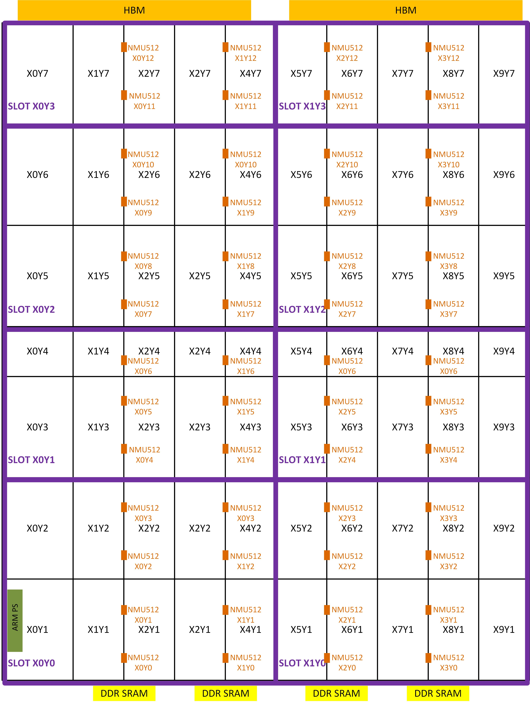
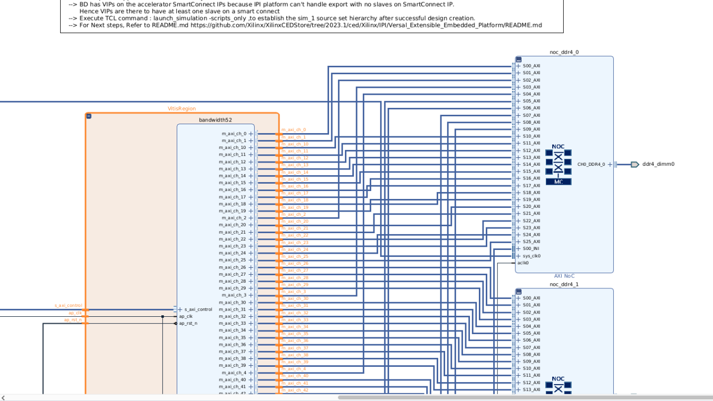
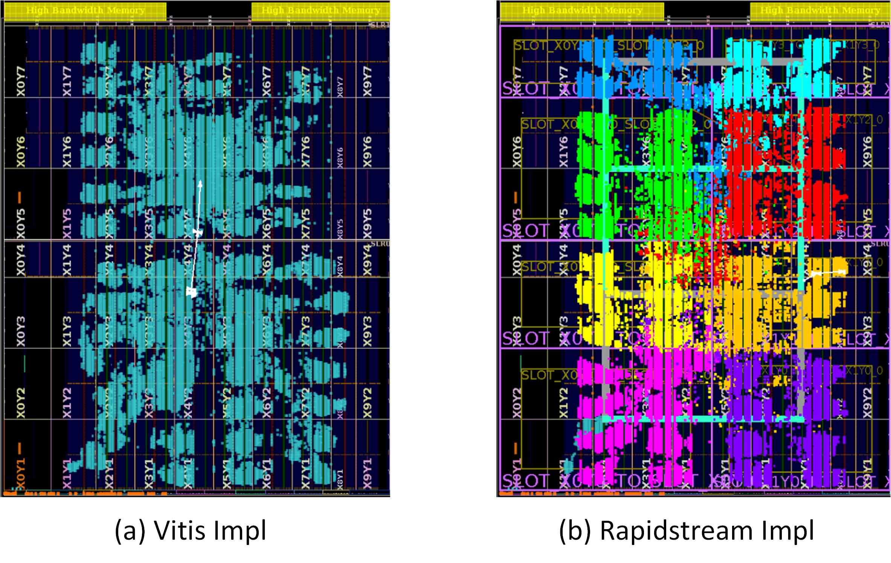

<!--
Copyright (c) 2024 RapidStream Design Automation, Inc. and contributors.  All rights reserved.
The contributor(s) of this file has/have agreed to the RapidStream Contributor License Agreement.
-->


# TAPA Flow: Bandwidth52

## Introduction

The AMD Versal device introduces a revolutionary hardware architecture for FPGA developers.
One standout feature is the distributed NoC AXI master/slave ports spread across the entire chip,
which is especially beneficial for kernels requiring numerous ports. For instance, in Alveo devices,
utilizing HBM bandwidth at the chip's base requires routing 32 AXI ports, each 512 bits wide, close
to the HBM—posing significant implementation challenges. With the Versal architecture, however,
these 32 AXI ports can be distributed across different regions of the chip, alleviating local routing congestion.
Also, larger versal device (VHK158) can support more than 32 AXI ports while Alveo can support at most 32
AXI ports, which is equivalent to  32 HBM Pseudo Channels (PC), sometime also referred as banks, each of 256 MB (2 GB).

Nevertheless, routing these ports across the chip introduces the challenge of connecting them
with long wires on Versal device. To optimize the effectiveness of the NoC architecture, RapidStream can be employed
to automatically insert pipeline registers between distributed logic. This approach not only achieves
high bandwidth through multiple AXI ports but also mitigates the local routing congestion seen in
previous architectures like the Alveo device.


In this recipe, we demonstrate how to utilize RapidStream to optimize a TAPA design that features
a kernel with 52 AXI ports, each 512 bits wide. While Vitis implementations encounter cross-SLR
timing violations, our approach follows these key steps to overcome the challenge:

- Compile the TAPA C++ code into a Vitis-compatible `.xo` file using TAPA.
- Optimize the generated `.xo` file with RapidStream to produce an enhanced `.xo` file.
- Use Vitis to compile the optimized `.xo` file into an .xclbin file for FPGA deployment.

## Tutorial

### Step 1 : Generate the Xilinx Object File (`.xo`)


We use [Rapidstream-TAPA](https://github.com/rapidstream-org/rapidstream-tapa)  to generate the `.xo` file,
with the original C++ source files located in the [design](./design) directory. To compile the C++ code
into a `.xo` file using TAPA, follow the commands provided below. For convenience,
you can also execute the `make xo` command in the terminal, as supported by our Makefile.

```bash
mkdir -p build/run_vhk158.py
cd build/run_vhk158.py && tapa compile \
--top bandwidth52 \
--part-num xcvh1582-vsva3697-2MP-e-S \
--clock-period 3.33 \
-o bandwidth52.xo \
-f design/bandwidth52.cpp \
2>&1 | tee tapa.log
```

### Step 2: Define Virtual Device

The VHK158 device is equipped with 4x13 NMU512 and NSU512 ports across the chip (only NMU512 ports are shown). For our design, we focus solely on the FPGA fabric without HBM. We define eight slots for the virtual device, each containing either 4-8 NMU512 ports to connect internal logic to the DDR SRAM at the base. A Python-based script, [run_vhk158.py](./run_vhk158.py), is provided as a reference for defining the virtual device using the RapidStream API.




You can run the `run_vhk158.py` script by invoking RapidStream as shown below, or simply type `make device` in the terminal. This will generate a `device.json` file, which outlines all the device features, including slot resources, slot locations, and more.


```bash
rapidstream run_vhk158.py
```

### Step 3: Use Rapidstream to Optimize `.xo` Design

The RapidStream flow conducts design space exploration and generates solutions  by taking all TAPA-generated `.xo` file as the input.
The RapidStream flow for TAPA requires the following key inputs:

- **tapa-xo-path**: The path to the tapa-generated `xo` file (bandwidth52.xo).
- **device-config**: The virtual device (`device.json`) generated in previous step 2 by calling rapidstream APIs based on platform.
- **floorplan-config**: The configure file ([ab_config.json](design/config/run_vhk158.py/ab_config.json)) to guide integrated Autobridge to floorplan the design.
- **implementation-config**: The configure file ([impl_config.json](design/config/run_vhk158.py/impl_config.json)) to guide Vitis to implement the design (e.g., kernel clock, vitis_platform and etc.).
- **connectivity-ini**: The link configure file ([link_config.ini](design/config/run_vhk158.py/link_config.ini)) to specify how the kernel interfaces are connected the memory controller. This is
the same for vitis link configure file.

We encapulate the rapidstream command for TAPA as `rapidstream-tapaop` for invoking.
You can run the command below or execute `make rs_xo` supported by our [Makefile](Makefile).

```bash
rapidstream-tapaopt --work-dir build/run_vhk158.py \
                    --tapa-xo-path build/run_vhk158.py/bandwidth52.xo \
                    --device-config build/run_vhk158.py/device.json \
                    --floorplan-config design/config/run_vhk158.py/ab_config.json \
                    --implementation-config design/config/run_vhk158.py/impl_config.json \
                    --connectivity-ini design/config/run_vhk158.py/link_config.ini
```

### Step 4: Fix Kernel Interfaces to NoC Network Master Unit (NMU512)

Vitis connects connect kernel interfaces automatically to the AXI slave ports of memory controller (MC).
For this case, MCs are `noc_ddr4_0` and `noc_ddr4_1`.
Next, Vitis maps the AXI slave ports of memory controller to the physical Network Master Units across
the chip according to bandwidth requirements. However, our flooplan is based fixed mapping between
kernel interfaces and MNU512. Therefore, we need to fix the kernel interfaces to the designated
MNU512 ports according to the configure file ([ab_config.json](design/config/run_vhk158.py/ab_config.json)).





To make this hack work, we will call `v++` twice. For the first time, we use `--to_step vpl.synth`
option to generate post-RTL-synthesis design. Next, we use a manual-crafted
`.tcl` file ([fix_noc.tcl](design/config/run_vhk158.py/fix_noc.tcl)) to map AXI slave interfaces
of the memory controller to fixed NOC NMU512 locations and re-synthesize the design. Finally,
we call `v++` second time by using `--from_step vpl.impl` option to reserve the NoC mapping
constraints to implement the whole design.

You can execute `make rs_xclbin` to complete the process.

### Step 5: Check Timing Report

After the design is successfully implemented in previous step, you can check the timing slack my
executing `make all`. The `build.json` file can be found in the work directory `build/run_vhk158.py/build.json`.
We can see the slack is 0.135 ns for 3.333 ns constraint, which means we achieve 312.80 MHz clock frequency.

```json
{
    "solution_0_global_slack": "0.135",
    "solution_0_target_clk_slack": "0.135",
    "solution_0_target_clk": "3.333ns",
    "solution_0_frequency_achieved": "312.70 MHz"
}
```

### Step 6: Implement Baseline with Vitis


We can directly invoke `Vitis` to implement the design on the VHK158 by running the `make hw` command.
After the implementation, you'll notice a slack of -0.288 ns against the 3.333 ns constraint.

### Step 7: Compasison between Vitis and Rapidstream.

Upon reviewing the post-route `ext_platform_wrapper_routed.dcp`, we have identified the top
10 critical paths, as highlighted in the figures below. Notably, these paths are constrained by
cross-SLR long routes. In contrast, RapidStream optimizes efficiency by confining the critical path
to a localized area.




The table below shows the slack comparisons.

| Implementation Type | Clock Constraint / ns| Timing Slack / ns | Max Frequency / MHz |
|:-------------------:|:--------------------:|:-----------------:|:-------------------:|
| Vitis               | 3.333                | -0.288            | 276.16              |
| Rapidstream         | 3.333                | 0.135             | 312.69              |
