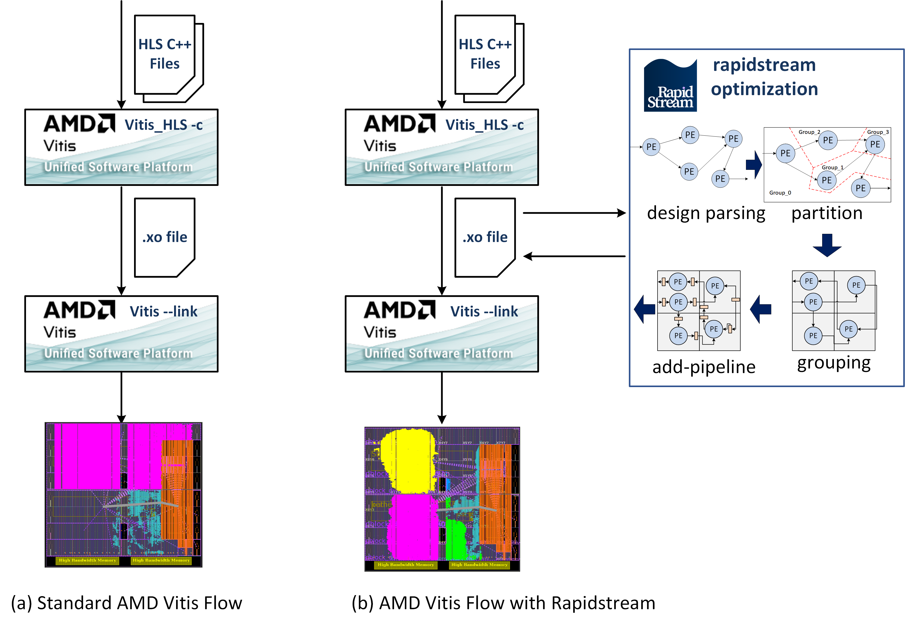

<!--
Copyright (c) 2024 RapidStream Design Automation, Inc. and contributors.  All rights reserved.
The contributor(s) of this file has/have agreed to the RapidStream Contributor License Agreement.
-->

# Vitis Flow Benchmarks

Rapidstream seamlessly integrates with AMD Vitis, enabling optimization of Vitis object files (`.xo`) to enhance FPGA development workflows. By taking `.xo` files as input, Rapidstream optimizes and outputs optimized .xo files, maintaining compatibility with Vitis's v++ -link command for streamlined development.

In this recipe, we illustrate how to create a Vitis objective file (.xo) using Vitis, then optimize the .xo file with Rapidstream, and finally utilize the optimized output in the ongoing Vitis development process.

# How it works

The figures below demonstrate how RapidStream seamlessly integrates with the Vitis flow. In Figure (a), within the standard AMD Vitis flow, HLS C++ files undergo initial compilation using `Vitis_HLS` and are stored as Xilinx Objective files (`.xo`). Subsequently, Vitis links the `.xo` file to the target FPGA device, executing tasks such as placement, routing, and bitstream generation.

Figure (b) illustrates the integration of RapidStream with the Vitis flow. Users continue to leverage Vitis HLS for compiling dataflow HLS C++ code into an Xilinx Objective file (`.xo`). Subsequently, RapidStream processes the `.xo` file, seamlessly implementing transformations like partitioning, floorplanning, and pipeline insertion. The optimized design is then re-packaged into another `.xo` file format, which can be integrated with standard Vitis tools to target FPGA devices for generating executable bitstreams (`xclbin`).

Compared to the standard Vitis flow, the RapidStream-aided Vitis flow shows distinct advantages in layout generation. The standard implementation tends to consolidate all logic within a single SLR (Super Logic Region), which can lead to local routing congestion. In contrast, RapidStream distributes the logic across four separate slots, effectively mitigating this congestion. Additionally, by incorporating pipeline registers after floorplanning, the extended route wires are less likely to impact the clock frequency negatively.

# Feature Tutorials

These tutorials target various FPGA devices. The table below lists the tutorials available, and the features and flows showcased in all of these tutorials.

<table border="1" width="100%">
    <tbody>
        <tr>
            <td ><strong>Design</strong></td>
            <td><strong>Developer</strong></td>
            <td><strong>Platforms</strong></td>
            <td><strong>Sources</strong></td>
            <td><strong>Purpose</strong></td>
        </tr>
        <tr>
            <td><a href="cnn13x2">CNN13x2</a></td>
            <td><a href="https://github.com/UCLA-VAST/AutoBridge">AutoBridge</a></td>
            <td align="center"> <a href="https://www.xilinx.com/products/boards-and-kits/alveo/u50.html"> U50 </a> 
                <a href="https://www.xilinx.com/products/boards-and-kits/alveo/u55c.html"> U55c </a> 
                <a href="https://www.xilinx.com/products/boards-and-kits/alveo/u280.html"> U280 </a> 
                <a href="https://www.xilinx.com/products/boards-and-kits/alveo/u250.html"> U250 </a></td>
            <td>Vitis HLS</td>
            <td>An HLS accelerator for the convolutional neural network kernel.</td>
        </tr>
        <tr>
            <td><a href="cnn13x4_16">CNN13x{4..16}</a></td>
            <td><a href="https://github.com/UCLA-VAST/AutoBridge">AutoBridge</a></td>
            <td align="center">
            <a href="https://www.xilinx.com/products/boards-and-kits/alveo/u250.html"> U250 </a></td>
            <td>Vitis HLS</td>
            <td>An HLS accelerator for the convolutional neural network kernel.</td>
        </tr>
        <tr>
            <td><a href="LLM">LLM</a></td>
            <td><a href="https://github.com/UCLA-VAST/AutoBridge">AutoBridge</a></td>
            <td align="center"> <a href="https://www.xilinx.com/products/boards-and-kits/alveo/u50.html"> U50 </a> 
                <a href="https://www.xilinx.com/products/boards-and-kits/alveo/u55c.html"> U55c </a> 
                <a href="https://www.xilinx.com/products/boards-and-kits/alveo/u280.html"> U280 </a> 
                <a href="https://www.xilinx.com/products/boards-and-kits/alveo/u250.html"> U250 </a>
            </td>
            <td>Vitis HLS</td>
            <td>A model-specific spatial acceleration for Large Language Model (LLM) inference on FPGAs.</td>
        </tr>
    </tbody>
</table>
