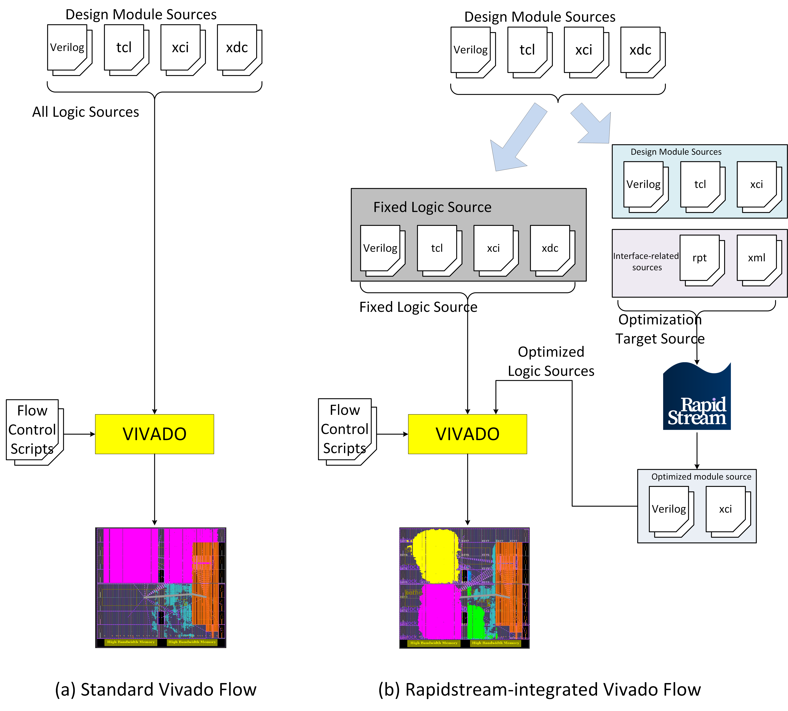
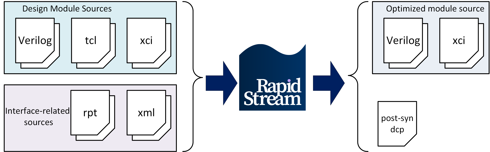

<!--
Copyright (c) 2024 RapidStream Design Automation, Inc. and contributors.  All rights reserved.
The contributor(s) of this file has/have agreed to the RapidStream Contributor License Agreement.
-->


# Large Language Model Design Tutorial

Although AMD Vitis is widely used for its support of high-level languages, Vivado remains the industry standard for FPGA development. In this tutorial, we will demonstrate how RapidStream optimizes the target logic and integrates it back into the standard Vivado workflow to improve timing.

## 1. Flow Description


The figure below illustrates the integration of RapidStream into the standard Vivado flow. As depicted in Figure (a), the standard Vivado flow accommodates various input logic sources, including Verilog, TCL, XCI (Xilinx Compiled IP), and XDC files. The compilation process from source to bitstream is typically managed by scripts, such as `SH` or `TCL`.



For a project, Xilinx-designed IPs are known for their reliability and high frequencies. Typically, the critical path resides in user-defined logic or kernels. Developers can extract the optimization target logic source files and feed them into RapidStream. Currently, RapidStream directly supports Verilog, TCL, and XCI files. If your logic files are generated by Vitis HLS, you will also need to provide the HLS report and XML files to RapidStream, enabling it to infer the interfaces of all module ports. RapidStream will then perform a source-to-source optimization. Subsequently, users can replace the previous unoptimized logic sources with the optimized ones and reuse the flow control scripts to launch Vivado, compiling the design sources into bitstreams.


## 2. Rapidstream Project Format

At this moment, Rapidstream mainly accepts text-based input sources as shown below.




Design modules can be represented by `.v`, `.tcl`, or `.xci` (Xilinx Compiled IP) files. Interface information can be described within the Verilog code as outlined in [getting_started/mixed_sources](../../../getting_started/mixed_sources). Alternatively, if your modules are compiled using `vitis_hls`, you can provide `.rpt` or `.xml` files.

```Python
from rapidstream import RapidStreamHLS, get_u50_default_device

# We create a RapidStream Pro project called "build":
rs = RapidStreamHLS(f"{CURR_DIR}/build")

# Use the predefined U50 virtual device:
rs.set_virtual_device(get_u50_default_device())

# Add all the source files
rs.add_vlog_files(list_of_vlog_file_paths)
rs.add_hls_tcl_ip_file(list_of_ip_tcl_paths)
rs.add_xci_files(list_of_tcl_file_paths)
rs.add_hls_report_dirs(list_of_hls_rpt_paths)
```

The input sources for RapidStream are similar to those used in a text-based Vivado project. Consequently, RapidStream can naturally support text-based Vivado projects. Users only need to add all the source files to the `RapidStreamHLS` class variable.


## Tutorial


### Step 1: Generate HLS Solution by `vitis_hls`

We use Vitis 2023.2 to generate the HLS solutions. Since we want to disable [free running pipeline (FRP)](https://www.xilinx.com/htmldocs/xilinx2021_2/hls-guidance/200-1553.html) feature for HLS step, we use [hls2rtl.tcl](../../../common/tcl/hls2rtl.tcl) to compile the C++ code to HLS solutions.

Run the following command or run `make clean && make hls`:

```bash
source <Vitis_install_path>/Vitis/2023.2/settings64.sh
make clean
mkdir -p build
vitis_hls ../../../common/tcl/hls2rtl.tcl \
  -l build/vitis_hls_bert_all.log \
  -tclargs \
  xcvu9p-flga2104-2L-e \
  3 \
  bert_all \
  0 \
  design/bert_region_1.cpp \
  design/bert_region_2.cpp \
  design/bert_region_3.cpp \
  design/bert_region_1.h \
  design/bert_region_2.h \
  design/bert_region_3.h \
  design/bert_all.cpp \
  design/kernel.h
```


### Step 2: Call RapidStream to Optimize the Design

The RapidStream flow conducts design space exploration and generates solutions (Verilog, XCI, XDC, etc.) by taking the Vitis generated solutions as the input. The RapidStream flow for Vitis requires four key inputs:

- **Device**: virtual device define by calling rapidstream APIs based on part number (e.g., `xcvu9p-flga2104-2L-e`).
- **HLS_solution**: A directory which includes all the HLS-generated files (Verilog, XML, RPT, etc.).
- **Verilog Files**: All the RTL source files.
- **XCI Files**: Xilinx Compiled IP files.
- **top_module_name**: Top module name for the kernel.
- **Clock**: All the clock and frequencies.

Please refer to [run_vu9p.py](./run_vu9p.py) for the complete RapidStream flow.

Perform the rapidstream optimization by calling command below or executing `make all`:

```bash
rapidstream ./run_vu9p.py
```

If everything is successful, you should at least get one post-synthesis `synth.dcp` file and all the source files for kernel `bert_all` located in `build/run/dse/candidate_0`.

### Step 3: Call `vivado` to Generate Bitstream

For this design, except the source files for the kernel, the other fixed logic can be generated by calling Vivado, such as adding PCIe, PLL and AXI-cross bars. However, we will use the kernel source files generated in Step 2 instead of the HLS generated kernel source files shown in the [control tcl scripts](./tcl/impl_rs.tcl).

```tcl
import_files run/dse/candidate_0/exported/design
import_ip [glob run/dse/candidate_0/exported/design/*/*.xci]
upgrade_ip -quiet [get_ips *]
generate_target synthesis [ get_files *.xci ]
add_files -fileset constrs_1 -norecurse run/dse/candidate_0/exported/xdc/floorplan.xdc
```
You can run to commands below or execute `make all` to get the final bitstream.

```bash
cd build
vivado -mode batch \
-source ../tcl/impl_rs.tcl \
-tclargs xcvu9p-flga2104-2L-e \
xilinx.com:vcu118:part0:2.4 \
../tcl/gen_design_vu9p.tcl
```
