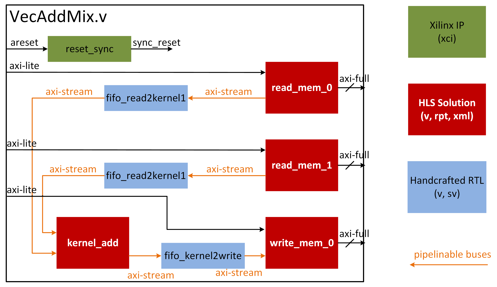

<!--
Copyright (c) 2024 RapidStream Design Automation, Inc. and contributors.  All rights reserved.
The contributor(s) of this file has/have agreed to the RapidStream Contributor License Agreement.
-->


# Mixed Sources Design


This recipe showcases RapidStream's ability to optimize a complex design that combines various source types, such as handcrafted RTL Verilog, solutions generated using High-Level Synthesis (HLS), and Xilinx Compiled intellectual property (xci) blocks.

`RapidStreamHLS` in this recipe is a set of low-level API that provides the flexibility.

## RapidStream Virtual Devices

To automatically optimize layout hints, resource information is required. We have pre-defined options for common devices:
[U50](https://www.xilinx.com/products/boards-and-kits/alveo/u50.html),
[U55c](https://www.xilinx.com/products/boards-and-kits/alveo/u55c.html),
[U250](https://www.xilinx.com/products/boards-and-kits/alveo/u250.html),
[U280](https://www.xilinx.com/products/boards-and-kits/alveo/u280.html),
[VHK158](https://www.xilinx.com/products/boards-and-kits/vhk158.html),
and
[VCK190](https://www.xilinx.com/products/boards-and-kits/vck190.html). However, you can also utilize the `DeviceFactory` to support custom parts and boards.

This example utilizes the predefined U50 virtual device, which divides the FPGA part into four equal slots, each occupying half of a Super Logic Region (SLR):


The Python snippet below demonstrates how to define the device configuration for the Alveo U50 device. The source file u50.py can be found in your RapidStream installation directory, such as
`<home_dir>/.rapidstream/opt/python3.10/lib/python3.10/site-packages/rapidstream/assets/device_library/u50/u50.py`.

In this setup, the Alveo U50 device is divided into four slots. The function factory.set_slot_pblock specifies the coordinates and ranges of these slots in units of clock regions. For example, SLOT_X0Y0 encompasses all clock regions from CLOCKREGION_X0Y0 to CLOCKREGION_X3Y3. The function extract_slot_resources calls vivado to extract the resources within the clock regions defined by set_slot_pblock. Additionally, set_slot_capacity configures the LAGUNA routing resources for crossing SLR wires. Since the Alveo U50 contains two SLRs, only the north of SLOT_X0Y0 and SLOT_X1Y0, and the south of SLOT_X0Y1 and SLOT_X1Y1 have SLR crossing capacity.


```Python
def get_u50_default_device_factory() -> DeviceFactory:
    """Get a U50 default device factory."""
    factory = DeviceFactory(row=2, col=2, part_num=U50_PART_NAME, board_name=None)

    factory.set_slot_pblock(0, 0, ["-add CLOCKREGION_X0Y0:CLOCKREGION_X3Y3"])
    factory.set_slot_pblock(1, 0, ["-add CLOCKREGION_X4Y0:CLOCKREGION_X7Y3"])
    factory.set_slot_pblock(0, 1, ["-add CLOCKREGION_X0Y4:CLOCKREGION_X3Y7"])
    factory.set_slot_pblock(1, 1, ["-add CLOCKREGION_X4Y4:CLOCKREGION_X7Y7"])

    factory.extract_slot_resources()

    # set SLR crossing capacity
    factory.set_slot_capacity(0, 0, north=11520)
    factory.set_slot_capacity(0, 1, south=11520)
    factory.set_slot_capacity(1, 0, north=11520)
    factory.set_slot_capacity(1, 1, south=11520)

    return factory


def get_u50_default_device(output_path: Path | None = None) -> VirtualDevice:
    """Get a U50 default device."""
    factory = get_u50_default_device_factory()
    return factory.generate_virtual_device(output_path)
```


## Design Source Format

RapidStream supports Verilog files, whether they are handcrafted or generated by tools. In this tutorial, we will recreate the VecAdd example from [vitis_source](../vitis_source/README.md), using source files from a different origin.



The VecAddMix design has 3 types of input source:

- `read_mem_0`, `read_mem_1`, `write_mem_0` and `kernel_add` are generated by compiling [HLS C++ code](./design/hls/VecAdd.cpp) by `Vitis_HLS`.

- A reset synchronouser module is from an [`.xci`](./design/xci/ip/design_1_proc_sys_reset_0_0/design_1_proc_sys_reset_0_0.xci) from Xilinx.

- The HLS-generated modules above are connected by [streaming-fifos](./design/rtl/sync_fifo.v) which is a manual designed Verilog file in a [top Verilog file](./design/rtl/VecAddMix.v).

Raidstream realies on the handshake interfaces to add pipeline registers to improve timing.  For this case, rapidstream will infer the interface types of `read_mem_0`, `read_mem_1`, `write_mem_0` and `kernel_add` from their HLS-generated reports. However, only both source and target ports qualify the handshake criteria can the link be pipelinable. For the streaming fifo modules, we need manually specify the types of ports in the [Verilog file](./design/rtl/sync_fifo.v) as below.

```verilog
(* RS_HS = "inbound.data"   *) input [DSIZE-1:0]  din_TDATA;
(* RS_HS = "inbound.valid"  *) input              din_TVALID;
(* RS_HS = "inbound.ready"  *) output             din_TREADY;
(* RS_HS = "outbound.data"  *) output [DSIZE-1:0] dout_TDATA;
(* RS_HS = "outbound.valid" *) output             dout_TVALID;
(* RS_HS = "outbound.ready" *) input              dout_TREADY;
(* RS_CLK                   *) input              clk;
(* RS_RST = "ff"            *) input              rst_n;
```

In this example, there are:
* Two handshake interfaces (`RS_HS`):
  * `inbound` interface: input streaming data
  * `outbound` interface: output streaming data
* One default clock interface (`RS_CLK`) named `clk`
* One reset interface (`RS_RST`) named `rst_n`

For the most up-to-date pragma syntax, refer to the [RTL Interface Pragmas](https://docs.rapidstream-da.com/rtl-interface-pragmas/).


IP configuration files in the XCI format can be included, as demonstrated in this recipe. For instance,
[`design_1_proc_sys_reset_0_0.xci`](./design/xci/ip/design_1_proc_sys_reset_0_0/design_1_proc_sys_reset_0_0.xci) can be added. The interfaces defined in the XCI files will be analyzed, and the files will be utilized to determine resource usage and perform evaluations.


## Tutorial

### Step 1: Generate the HLS solutions

RapidStream can integrate modules or systems generated by High-Level Synthesis (HLS) into the project.
Run the command below to generate the HLS solutions form `read_mem`, `write_mem` and `kernel_add`.

```bash
source <Vitis_install_path>/Vitis/2023.2/settings64.sh
make hls
```

You can find the HLS-generated Verilog files under `build` for different kernels.
The interface information is automatically inferred from the HLS reports, such as
`./build/kernel_add/solution/syn/report/kernel_add_csynth.rpt`

This liminates the need for manual pragma additions to the RTL files.
For instance, `stream_*` interfaces with HLS `axis` protocols will be inferred as handshake interfaces. RapidStream uses `.xml` files instead of `.rpt` files for this purpose. The `.rpt` screenshot here is for a readable demonstration purpose:

```
================================================================
== Interface
================================================================
* Summary:
+-------------------+-----+-----+--------------+--------------+--------------+
|     RTL Ports     | Dir | Bits|   Protocol   | Source Object|    C Type    |
+-------------------+-----+-----+--------------+--------------+--------------+
|ap_clk             |   in|    1|  ap_ctrl_none|    kernel_add|  return value|
|ap_rst_n           |   in|    1|  ap_ctrl_none|    kernel_add|  return value|
|stream_in1_TVALID  |   in|    1|          axis|    stream_in1|       pointer|
|stream_in1_TDATA   |   in|   32|          axis|    stream_in1|       pointer|
|stream_in1_TREADY  |  out|    1|          axis|    stream_in1|       pointer|
|stream_in2_TVALID  |   in|    1|          axis|    stream_in2|       pointer|
|stream_in2_TDATA   |   in|   32|          axis|    stream_in2|       pointer|
|stream_in2_TREADY  |  out|    1|          axis|    stream_in2|       pointer|
|stream_out_TREADY  |   in|    1|          axis|    stream_out|       pointer|
|stream_out_TDATA   |  out|   32|          axis|    stream_out|       pointer|
|stream_out_TVALID  |  out|    1|          axis|    stream_out|       pointer|
+-------------------+-----+-----+--------------+--------------+--------------+
```

### Step 2: Run Rapidstream to Generate OOC Implementation

After we get the HLS solutions ready in step 1, we can use rapidstream to optimized the mixed design. For simplicity, we only generated the Out-of-Context implementation results for fast demonstration.

In [run.py](./run.py) file, we show how to use the APIs we provided to specify the constraints for
proper optimization by rapidstream.

For the handcrafted RTL and xci files, we need to specify the source directory by:

```python
rs.add_vlog_dir(f"{CURR_DIR}/design/rtl")
rs.add_xci_dir(f"{CURR_DIR}/design/xci/ip/design_1_proc_sys_reset_0_0")

```

For the HLS-generated solutions, we specify the directories as below, such that rapidstream can infer the interfaces from the `.rpt` or `.xml` files.

```python
rs.add_hls_solution(f"{CURR_DIR}/build/kernel_add/solution")
rs.add_hls_solution(f"{CURR_DIR}/build/read_mem/solution")
rs.add_hls_solution(f"{CURR_DIR}/build/write_mem/solution")
```

For better optimizing the manual designs, we must explicitly define the placement of ports on the device by applying constraints. For instance, if we want to assign ports to a specific region, such as HBM AXI 16-31, we need to utilize the appropriate API to allocate the ports to their designated slots X1Y0.

```python
rs.assign_port_to_region(".*", "SLOT_X1Y0:SLOT_X1Y0")
```

We can utilize assign_cell_to_region in a regular expression manner to designate target cells to specific SLOT regions. To demonstrate this capability, we have intentionally assigned four modules to four distinct SLOTS as shown below.

```python
rs.assign_cell_to_region(".*kernel_add.*", "SLOT_X0Y1:SLOT_X0Y1")
rs.assign_cell_to_region(".*fifo_read2kernel0.*", "SLOT_X0Y1:SLOT_X0Y1")
rs.assign_cell_to_region(".*fifo_read2kernel1.*", "SLOT_X0Y0:SLOT_X0Y0")
rs.assign_cell_to_region(".*fifo_kernel2write.*", "SLOT_X1Y1:SLOT_X1Y1")
```

After all, we run rapidstream to optimize the design by running the command below or execute `make all`:


```bash
source <Vitis_install_path>/Vitis/2023.2/settings64.sh
rapidstream ./run.py
```

When execution is completed, we found the target modules are assigned to target SLOTS.

```
+------------------+------------------------+------+------+----------+-----+------+
|name              | floorplan              |   ff |  lut | bram_18k | dsp | uram |
+------------------+------------------------+------+------+----------+-----+------+
|fifo_read2kernel1 | SLOT_X0Y0_TO_SLOT_X0Y0 |   20 |   31 |        1 |   0 |    0 |
|read_mem_0        | SLOT_X1Y0_TO_SLOT_X1Y0 | 2509 | 1526 |       15 |   0 |    0 |
|read_mem_1        | SLOT_X1Y0_TO_SLOT_X1Y0 | 2509 | 1526 |       15 |   0 |    0 |
|reset_syncer      | SLOT_X1Y0_TO_SLOT_X1Y0 |   40 |   18 |        0 |   0 |    0 |
|write_mem_0       | SLOT_X1Y0_TO_SLOT_X1Y0 | 2359 | 1559 |       16 |   0 |    0 |
|fifo_read2kernel0 | SLOT_X0Y1_TO_SLOT_X0Y1 |   20 |   31 |        1 |   0 |    0 |
|kernel_add_0      | SLOT_X0Y1_TO_SLOT_X0Y1 |  645 |  310 |        0 |   2 |    0 |
|fifo_kernel2write | SLOT_X1Y1_TO_SLOT_X1Y1 |   20 |   31 |        1 |   0 |    0 |
+------------------+------------------------+------+------+----------+-----+------+
```

The final OoC implementation layout is as below.


## RapidStream Flow

Call the RapidStream API to create a design space exploration (DSE) flow by running commands in the terminal.


## Outputs

The RapidStream flow performs design space exploration and creates optimized design checkpoint (`.dcp`) files. To find these files, run the following command in your terminal:

```bash
find ./build/dse -name *.dcp
```

To review the timing results for each generated design point, use this command:

```bash
find ./build/dse -name timing_summary.rpt
```

These commands will help you locate and analyze the relevant files within the `./build/dse` directory.

## Next Step

  **Click here to [go back to Getting Started](../README.md)**
