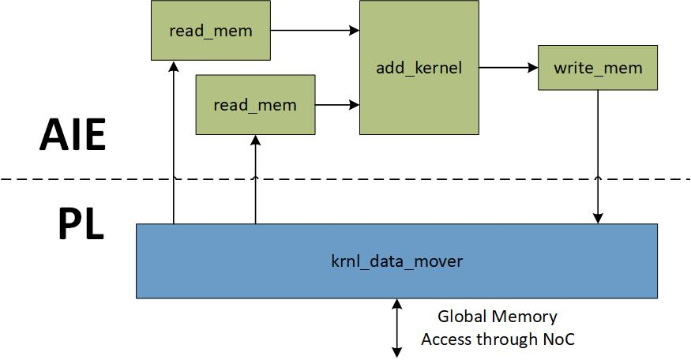

<!--
Copyright (c) 2024 RapidStream Design Automation, Inc. and contributors.  All rights reserved.
The contributor(s) of this file has/have agreed to the RapidStream Contributor License Agreement.
-->


# TAPA AI Engine Design

## Introduction


Rapidsteam is fully compatible with [TAPA](https://github.com/rapidstream-org/rapidstream-tapa).
In this recipe, we illustrate how to write TAPA C++ code to create an application, where some tasks are mapped to AI engines (AIE) and some parts are mapped to FPGA fabrics (PL).

## AI Engine design graph

The [Vitis compiler flow](https://docs.amd.com/r/2022.2-English/ug1076-ai-engine-environment/Integrating-the-Application-Using-the-Vitis-Tools-Flow)
enables seamless integration of your compiled AI Engine graph (libadf.a) with additional kernels implemented
in the device’s programmable logic (PL) region, including those developed using HLS or RTL. These components
can then be linked together for deployment on a target platform. From a host application running on the ARM
processor within the Versal device—or on a CPU, depending on the platform—you can invoke these compiled
hardware functions directly.


## Application Introduction

[VecAdd.cpp](design/VecAdd.cpp) contains the source code for the application, primarily comprising the
`krnl_data_mover` and `aie_add` modules, which are mapped to the PL and AIE regions, respectively. The
`aie_add` module includes four kernels: two `read_mem` kernels, one `write_mem` kernel, and one `add` kernel.
Each of these is annotated with `[[tapa::target("aie", "xilinx")]]`, instructing the TAPA compiler to map them
to the AI Engine. Meanwhile, the `krnl_data_mover` is mapped to the PL region by default by the TAPA compiler.





## Tutorial

### Step 1: C++ Simulation

Since our
design calls Xilinx Libraries, we need to source the Vitis environment before running the simulation.

```bash
source <Vitis_install_path>/Vitis/2022.2/settings64.sh
```

Before generating the `.xo` file, we recommend running a C++ simulation to verify the correctness of the design. This step is optional but highly recommended. Run the following command or `make csim` to perform C++ simulation:

```bash
mkdir -p build
cd build
tapa g++ ../design/main.cpp VecAdd.cpp \
-I /opt/tools/xilinx/Vitis_HLS/2022.2/include \
-o main.exe -O2
./main.exe
```

Your should see the following output:

```bash
...
WARNING: Logging before InitGoogleLogging() is written to STDERR
I20250331 18:25:36.572566 3799133 task.h:83] running software simulation with TAPA library
kernel time: 0.00364275 s
PASS!
```

### Step 2: Generate the Xilinx Object File (`.xo`)

We use TAPA on top of 2022.2 to generate the `.xo` file. Run the following command or run `make xo`:

```bash
source <Vitis_install_path>/Vitis/2022.2/settings64.sh
mkdir -p build
cd build
tapa compile \
--top krnl_data_mover \
--platform xilinx_vck5000_gen4x8_qdma_2_202220_1 \
--flow-type hls \
--clock-period 3.33  \
--keep-hls-work-dir \
-f ../design/VecAdd.cpp \
-o krnl_data_mover.xo \
2>&1 | tee tapa.log
```
### Step 3: Generate the AIE libadf.a

We use TAPA on top of 2022.2 to generate the `.a` file for the AIE graph. Run the following command or run `make aie`:

```bash
mkdir -p build
cd build
tapa compile \
--top aie_add \
--platform xilinx_vck5000_gen4x8_qdma_2_202220_1 \
--flow-type aie \
--clock-period 3.33  \
--keep-hls-work-dir \
-f ../design/VecAdd.cpp \
2>&1 | tee tapa.log
```

Note that we change the `--flow-type` to `aie` this time to enable TAPA AIE compiler for the AIE
graph compilation.


### Step 4: Use Vitis --link to Generate the `.xsa` File

With the `.xo` file  and `libadf.a` generated in the previous steps, you can use `v++ -link` to generate the `.xsa` file. Run the following command or execute `make xsa`:

```bash
mkdir -p build
cd build
v++ -l \
--kernel_frequency 200 \
--to_step vpl.update_bd \
--platform  xilinx_vck5000_gen4x8_qdma_2_202220_1 \
-t hw \
-g \
--vivado.synth.jobs 16 \
--save-temps \
--config ../design/config/xclbin_overlay.cfg \
-o overlay_hw.xsa \
krnl_data_mover.xo work.out/aie/aie_add/libadf.a
v++ -l \
--kernel_frequency 200 \
--from_step vpl.generate_target \
--platform  xilinx_vck5000_gen4x8_qdma_2_202220_1 \
-t hw \
-g \
--vivado.synth.jobs $(JOBS) \
--save-temps \
--config ../design/config/xclbin_overlay.cfg \
-o overlay_hw.xsa \
krnl_data_mover.xo work.out/aie/aie_add/libadf.a
```

### Step 5: Use Vitis --link to Generate the `.xclbin` File

With the generated `.xsa` file, we can launch Vitis to make the `.xclbin` file for FPGA deployment by
executing such command below or `make xlcibn`:

```bash
cd build
v++ -p -t hw
-f xilinx_vck5000_gen4x8_qdma_2_202220_1
overlay_hw.xsa work.out/aie/aie_add/libadf.a \
-o overlay_hw.xclbin --package.boot_mode=ospi
```


:warning: **Note**: This step can take hours to complete.

### Step 6: Run Application

If your machines is equipped with the target FPGA device, you can deploy the optimized design on the FPGA by running the following command or `make run`:

```bash
cd build
./main.exe --bitstream ./overlay_hw.xclbin
```

You should see similar outputs as below in the terminal:

```bash
[XRT] WARNING: unaligned host pointer '0x55bf72e6d1a0' detected, this leads to extra memcpy
[XRT] WARNING: unaligned host pointer '0x55bf72e6d2b0' detected, this leads to extra memcpy
[XRT] WARNING: unaligned host pointer '0x55bf72e6d3c0' detected, this leads to extra memcpy
kernel time: 0.000135739 s
PASS!
```


## Next Step

  **Click here to [go back to Getting Started](../README.md)**
